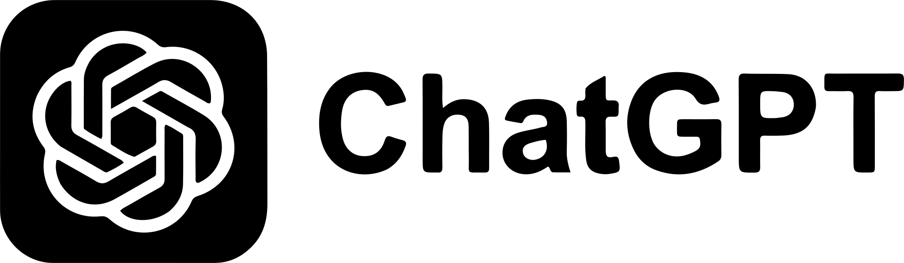

::: {.info header="🧊 Icebreaker Séance 1 : Le Test de Turing inversé"}
**Script pour l'enseignant :**
"Bonjour à tous et bienvenue dans ce module intensif. Avant de coder, faisons une expérience. Sortez vos téléphones. Je vais afficher 3 textes au tableau. Votre mission : identifier lequel a été écrit par un humain, lequel par un modèle pré-entraîné des années 2010, et lequel par un LLM récent. 
*Indice : l'IA d'aujourd'hui fait souvent moins de fautes de syntaxe que nous, mais manque parfois cruellement de bon sens.*"
(Cet exercice sert à briser la glace et à introduire empiriquement la différence entre les anciennes et les nouvelles générations d'IA).
:::

## 1.1 Genèse et Écosystème de l'IA : D'Alan Turing aux LLMs 🌍 

[🔍 Zoom sur cette section](11_genese_et_ecosysteme_de_lia__dalan_turing_aux_llms.qmd){.btn .btn-outline-primary .btn-sm}

:::: {.timeline .vertical}

::: {.event data-label="1950"}
| Alan Turing | Le Test de Turing |
|:---|:---|
| {width=80px} | *Fondation philosophique* : Les machines peuvent-elles penser ? Invention du "jeu de l'imitation". |
:::

::: {.event data-label="1956"}
| McCarthy & Minsky | La Naissance |
|:---|:---|
| {width=80px} | *Concept* : Conférence de Dartmouth. Le terme "Intelligence Artificielle" est officiellement inventé. |
:::

::: {.event data-label="Années 1980"}
| Edward Feigenbaum | L'Âge des Systèmes Experts |
|:---|:---|
| {width=80px} | *Logique pure* : Apogée puis déclin des programmes basés sur des règles strictes ("Si... Alors"). Premier hiver de l'IA. |
:::

::: {.event data-label="1989-1997"}
| Yann LeCun | Puissance brute et Apprentissage |
|:---|:---|
| {width=80px} | *Transition* : LeNet de Yann LeCun (1989) pose les bases du Deep Learning. Deep Blue bat Kasparov aux échecs (1997) par la force de calcul. |
:::

::: {.event data-label="2016"}
| Google DeepMind | La Révolution Deep Learning |
|:---|:---|
| {width=80px} | *Intuition artificielle* : L'IA de Google DeepMind bat le champion du monde de Go grâce à l'apprentissage par renforcement. |
:::

::: {.event data-label="2022"}
| OpenAI | L'Ère Générative |
|:---|:---|
| {width=80px} | *Basculement* : Démocratisation brutale des LLM (Large Language Models) par OpenAI. Début de la course aux armements. |
:::

::: {.event data-label="2025-2026"}
| DeepSeek | Le Mur Matériel et Économique |
|:---|:---|
| {width=80px} | *Raisonnement & Krach* : Le modèle ultra-efficient de DeepSeek bouscule le monopole de Nvidia (2025). L'industrie fait face à une pénurie mondiale de mémoire vive (2026). |
:::

::::

## 1.2 Anatomie Fonctionnelle des Réseaux de Neurones 🧠 

[🔍 Zoom sur cette section](12_anatomie_fonctionnelle_des_reseaux_de_neurones.qmd){.btn .btn-outline-primary .btn-sm}

### 1.2.1 L'Architecture en 3 Couches (Layers) 🧅

*   📥 **Input Layer (Entrée) :** Réception. Capte les données brutes (pixels, texte, valeurs). Aucun calcul.
*   🧠 **Hidden Layers (Cachées) :** Abstraction. Cœur de l'intelligence. Calculs matriciels pour extraire des motifs de plus en plus complexes (bords $\rightarrow$ formes $\rightarrow$ visage).
*   📤 **Output Layer (Sortie) :** Verdict. Délivre la décision finale (probabilité, classification, valeur numérique).

[Réseau de Neurones](https://view.genially.com/69144ab3e5ccc00eb91c4628){.embed}


### 1.2.2 La Danse du Signal (Le Cycle d'Apprentissage) 🔄
*   ➡️ **Feedforward (Propagation) :** La donnée traverse le réseau de gauche à droite. Génère une prédiction (au début, totalement aléatoire).
*   ⬅️ **Backpropagation (Rétropropagation) :** Le réseau calcule son erreur (Loss Function) et remonte le signal à l'envers pour ajuster les *poids* et les *biais* de chaque neurone. C'est ainsi que la machine "apprend".


## 1.3 Les Fonctions d'Activation : Le Moteur de la Non-Linéarité ⚡ 

[🔍 Zoom sur cette section](13_les_fonctions_dactivation__le_moteur_de_la_non-linearite.qmd){.btn .btn-outline-primary .btn-sm}

Sans fonction d'activation, même un réseau de neurones gigantesque ne serait qu'une simple régression linéaire. Ces fonctions agissent comme des portes et introduisent la **non-linéarité**, ce qui permet au modèle d'apprendre des choses complexes (comme les courbes d'un visage).

### 1.3.1 Les 4 "Classiques" en bref :

*   **Sigmoïde :** Ramène les valeurs entre 0 et 1. Idéale pour prédire une probabilité binaire (Oui/Non).
*   **Tanh :** Ramène les valeurs entre -1 et 1. Souvent plus rapide que la sigmoïde.
*   **ReLU :** La plus populaire. Elle agit comme un filtre : elle bloque les valeurs négatives (donne 0) et laisse passer les valeurs positives. 
*   **Softmax :** Utilisée à la fin du réseau pour transformer les résultats en un pourcentage de probabilités (total = 100%).


::: {.graph header="Fonctions d'Activations Classiques"}

::: {.controls}
```{ojs}
//| echo: false
viewof x_val = ui.slider({
  label: "Valeur de x",
  value: 0,
  min: -5,
  max: 5,
  step: 0.1
})

sigmoid = (x) => 1 / (1 + Math.exp(-x))
tanh = (x) => Math.tanh(x)
relu = (x) => Math.max(0, x)
softmax = (x) => Math.exp(x) / (Math.exp(x) + Math.exp(0) + Math.exp(1)) // Cas 3-classes (x vs 0 vs 1)

data = {
  const points = [];
  for (let x = -5; x <= 5; x += 0.2) {
    points.push({x: x, y: sigmoid(x), type: "Sigmoïde"});
    points.push({x: x, y: tanh(x), type: "Tanh"});
    points.push({x: x, y: relu(x), type: "ReLU"});
    points.push({x: x, y: softmax(x), type: "Softmax"});
  }
  return points;
}
```

:::

::: {.render}
```{ojs}
//| echo: false
Plot.plot({
  height: 400,
  background: "transparent",
  grid: true,
  y: {domain: [-1.1, 1.1], label: "Activation"},
  color: {legend: true, domain: ["Sigmoïde", "Tanh", "ReLU", "Softmax"], range: [theme.red, theme.green, theme.blue, theme.magenta]},
  marks: [
    Plot.ruleY([0]),
    Plot.ruleX([0]),
    Plot.line(data, {x: "x", y: "y", stroke: "type", strokeWidth: 2}),
    Plot.dot([{x: x_val, y: sigmoid(x_val)}], {x: "x", y: "y", fill: theme.red}),
    Plot.dot([{x: x_val, y: tanh(x_val)}], {x: "x", y: "y", fill: theme.green}),
    Plot.dot([{x: x_val, y: relu(x_val)}], {x: "x", y: "y", fill: theme.blue}),
    Plot.dot([{x: x_val, y: softmax(x_val)}], {x: "x", y: "y", fill: theme.magenta})
  ]
})
```
:::

::: {.results}
```{ojs}
//| echo: false
ui.card(md`| Sigmoïde(x) | Tanh(x) | ReLU(x) | Softmax(x) |
|:---:|:---:|:---:|:---:|
| **${sigmoid(x_val).toFixed(3)}** | **${tanh(x_val).toFixed(3)}** | **${relu(x_val).toFixed(3)}** | **${softmax(x_val).toFixed(3)}** |`, {
  title: "Valeurs d'Activation"
})
```
:::
:::


### 1.3.2 L'Ère Moderne (Spécial IA Générative) ✨
Aujourd'hui, les modèles avancés (comme ChatGPT ou BERT) utilisent des fonctions plus complexes et lissées pour de meilleures performances :

*   **GELU :** La norme pour les *Transformers*.
*   **SELU :** S'auto-normalise pour les réseaux très profonds.
*   **Swish :** Développée par Google, idéale pour les très gros réseaux.

::: {.graph header="Fonctions d'Activations Modernes"}

::: {.controls}
```{ojs}
//| echo: false
viewof x_modern = ui.slider({
  label: "Valeur de x (moderne)",
  value: 0,
  min: -5,
  max: 5,
  step: 0.1
})

swish = (x) => x / (1 + Math.exp(-x))
gelu = (x) => 0.5 * x * (1 + Math.tanh(Math.sqrt(2 / Math.PI) * (x + 0.044715 * Math.pow(x, 3))))
selu = (x) => { const lambda = 1.0507; const alpha = 1.6733; return x > 0 ? lambda * x : lambda * alpha * (Math.exp(x) - 1); }

data_modern = {
  const points = [];
  for (let x = -5; x <= 5; x += 0.2) {
    points.push({x: x, y: swish(x), type: "Swish"});
    points.push({x: x, y: gelu(x), type: "GELU"});
    points.push({x: x, y: selu(x), type: "SELU"});
  }
  return points;
}
```
:::

::: {.render}
```{ojs}
//| echo: false
Plot.plot({
  height: 400,
  background: "transparent",
  grid: true,
  y: {domain: [-2, 0.7], label: "Activation"},
  x: {domain: [-3, 3], label: "x"},
  color: {legend: true, domain: ["Swish", "GELU", "SELU"], range: [theme.orange, theme.magenta, theme.red]},
  marks: [
    Plot.ruleY([0]),
    Plot.ruleX([0]),
    Plot.line(data_modern, {x: "x", y: "y", stroke: "type", strokeWidth: 3}),
    Plot.dot([{x: x_modern, y: swish(x_modern)}], {x: "x", y: "y", fill: theme.orange}),
    Plot.dot([{x: x_modern, y: gelu(x_modern)}], {x: "x", y: "y", fill: theme.magenta}),
    Plot.dot([{x: x_modern, y: selu(x_modern)}], {x: "x", y: "y", fill: theme.red})
  ]
})
```
:::

::: {.results}
```{ojs}
//| echo: false
ui.card(md`| Swish(x) | GELU(x) | SELU(x) |
|:---:|:---:|:---:|
| **${swish(x_modern).toFixed(3)}** | **${gelu(x_modern).toFixed(3)}** | **${selu(x_modern).toFixed(3)}** |`, {
  title: "Valeurs d'Activation (Modernes)"
})
```
:::
:::


## 1.4 Optimisation et Apprentissage : La Descente de Gradient 🏔️ 

[🔍 Zoom sur cette section](14_optimisation_et_apprentissage__la_descente_de_gradient.qmd){.btn .btn-outline-primary .btn-sm}

Si la fonction d'activation est le moteur de la non-linéarité, la descente de gradient est le volant qui dirige l'apprentissage. L'objectif d'un réseau de neurones est simple : trouver la combinaison exacte de millions (voire de milliards) de poids et de biais qui minimise les erreurs de prédiction.

Mathématiquement, l'erreur globale du modèle est mesurée par une **Fonction de Coût** (ou *Loss Function*, notée $J(\theta)$). L'optimisation consiste à trouver le point le plus bas de cette fonction dans un espace multidimensionnel [@daniella_2024_gradient; @ibm_2026_gradient].

### 1.4.1 Naviguer dans un paysage montagneux 🧗

L'objectif d'un réseau de neurones est simple : ajuster ses millions de paramètres pour faire le moins d'erreurs possible. Pour y arriver, il utilise une technique appelée la **descente de gradient**.

#### L'analogie de la montagne 🧗
Imaginez que vous êtes au sommet d'une montagne, les yeux bandés, et que vous devez rejoindre le point le plus bas de la vallée (le point où l'erreur de l'IA est à zéro). Votre seule technique : tâter le sol avec votre pied pour sentir la pente, et faire un pas dans la direction qui descend le plus fort. 

Mais ce paysage est trompeur :

*   **Minima locaux :** Des petits creux où vous pourriez rester coincé, pensant être tout en bas.
*   **Plateaux :** Des zones plates où la pente est invisible. 

::: {.graph header="Le Paysage du Coût"}

::: {.controls}
```{ojs}
//| echo: false
viewof x_sim = ui.slider({
  label: "Position de l'explorateur (x)",
  value: -2.1,
  min: -2.5,
  max: 2.5,
  step: 0.01
})

f_2d = (x) => Math.pow(x, 4) - 4 * Math.pow(x, 2) + 0.5 * x + 10
df_2d = (x) => 4 * Math.pow(x, 3) - 8 * x + 0.5

data_plot = d3.range(-2.5, 2.51, 0.05).map(x => ({x: x, y: f_2d(x)}))
```
:::

::: {.render}
```{ojs}
//| echo: false
Plot.plot({
  height: 400,
  background: "transparent",
  grid: true,
  y: {label: "Coût (Erreur)", domain: [0, 15]},
  x: {label: "Paramètre (Poids)"},
  marks: [
    Plot.areaY(data_plot, {x: "x", y: "y", fill: theme.blue, fillOpacity: 0.1}),
    Plot.line(data_plot, {x: "x", y: "y", stroke: theme.blue, strokeWidth: 3}),
    
    // Annotations conceptualisées
    Plot.text([{x: -1.45, y: 4.8, text: "Minimum Local ⬇️"}], {x: "x", y: "y", dy: -20, fontWeight: "bold", fontSize: 14}),
    Plot.text([{x: 1.38, y: 3.5, text: "Minimum Global 🏆"}], {x: "x", y: "y", dy: -20, fontWeight: "bold", fontSize: 14}),
    Plot.text([{x: 0.05, y: 10.2, text: "Plateau / Sommet ✋"}], {x: "x", y: "y", dy: -20, fontWeight: "bold", fontSize: 14}),
    
    // Le point actuel (la balle)
    Plot.dot([{x: x_sim, y: f_2d(x_sim)}], {x: "x", y: "y", fill: theme.red, r: 8, stroke: "white", strokeWidth: 2}),
    
    // La pente (tangente)
    Plot.link([{
      x1: x_sim - 0.4, y1: f_2d(x_sim) - 0.4 * df_2d(x_sim),
      x2: x_sim + 0.4, y2: f_2d(x_sim) + 0.4 * df_2d(x_sim)
    }], {x1: "x1", y1: "y1", x2: "x2", y2: "y2", stroke: theme.red, strokeWidth: 2, strokeDasharray: "4,2"})
  ]
})
```
:::

::: {.results}
```{ojs}
//| echo: false
{
  const gradient = df_2d(x_sim);
  const cost = f_2d(x_sim);
  const secondDeriv = 12 * Math.pow(x_sim, 2) - 8; // f''(x) = 12x^2 - 8
  
  let status = "debug";
  let message = "L'IA peut continuer à descendre...";
  
  if (Math.abs(gradient) < 0.2) {
    if (secondDeriv < 0) {
      status = "danger";
      message = "🛑 **ALERTE : Point de selle !** L'IA est bloquée sur un sommet instable";
    } else if (cost > 6) {
      status = "warning";
      message = "⚠️ **Minimum Local détecté !** C'est un creux, mais il existe un meilleur fond ailleurs";
    } else {
      status = "success";
      message = "✅ **Minimum Réel (Global) !** L'IA a trouvé le point le plus bas possible (Coût < 6).";
    }
  } else if (Math.abs(gradient) < 0.6) {
    status = "warning";
    message = "⚠️ **Zone de danger :** La pente est presque nulle. L'IA risque de s'arrêter ici !";
  }
  
  return ui.card(md`
| Pente (Gradient) | Coût (Erreur) |
|:---:|:---:|
| **${gradient.toFixed(3)}** | **${cost.toFixed(3)}** |

<div style="margin-top: 10px;">
  ${message}
</div>
`, { title: "Analyse en temps réel", status: status });
}
```
:::
:::


#### Comment on descend concrètement ? 🏃

Pour être efficace sans saturer la mémoire des ordinateurs, on ne lit pas toutes les données d'un coup.

| Algorithme | Fonctionnement | Avantages & Inconvénients |
| :--- | :--- | :--- |
| **Batch (Lot complet)** | Calcule l'erreur sur *toutes* les données avant d'avancer. | Trajectoire stable, mais beaucoup trop lent. |
| **Stochastic (SGD)** | Avance après *chaque* donnée individuelle. | Ultra-rapide, mais trajectoire chaotique. |
| **Mini-batch** | **Le compromis standard :** Avance par petits groupes de données (ex: 32). | Combine stabilité et rapidité. |

#### L'outil moderne : Adam 🛠️
Aujourd'hui, on ne descend plus aveuglément. On utilise l'algorithme **Adam**. Il simule une "boule de bowling" (l'inertie) qui dévale la pente, capable de remonter de petites bosses pour ne pas rester coincée, tout en adaptant sa vitesse intelligemment.

::: {.warning header="Le Paramètre Critique : Le Taux d'Apprentissage (Learning Rate)"}
Le *Learning Rate* détermine la taille de vos "pas" :

- **Trop grand :** Vous enjambez la vallée et rebondissez partout sans jamais descendre.
- **Trop petit :** Vous mettez des années à atteindre le fond, et le moindre caillou vous bloque.
:::

::: {.graph header="Paramètres du Gradient"}

::: {.controls}
```{ojs}
//| echo: false
viewof momentum = ui.slider({
  label: "Inertie (Momentum)",
  value: 0.771,
  min: 0.5,
  max: 1,
  step: 0.001
})

viewof btnDrop = {
  const btn = html`<button class="btn-physics-drop"><span>🔴</span> Lâcher la Balle</button>`;
  btn.onclick = () => {
    btn.value = (btn.value || 0) + 1;
    btn.dispatchEvent(new CustomEvent("input"));
  };
  return btn;
}
```
:::

::: {.render}
```{ojs}
//| echo: false
//| warning: false

Plotly = require("plotly.js-dist@2.24.1")

{
  const container = document.createElement("div");
  container.style.height = "500px";
  
  const x = []; const y = []; const z = [];
  for (let i = -2.5; i <= 2.5; i += 0.15) x.push(i);
  for (let j = -2.5; j <= 2.5; j += 0.15) y.push(j);

  for (let j = 0; j < y.length; j++) {
    const row = [];
    for (let i = 0; i < x.length; i++) {
      const xv = x[i]; const yv = y[j];
      row.push(Math.pow(xv, 4) - 4 * Math.pow(xv, 2) + Math.pow(yv, 2) + 0.5 * xv);
    }
    z.push(row);
  }

  const surfaceTrace = {
    x: x, y: y, z: z,
    type: "surface", colorscale: "Viridis", showscale: false,
    opacity: 0.9
  };

  let ballTrace = {
    x: [2.2], y: [1.5], z: [7.9],
    mode: "markers", type: "scatter3d", name: "La Balle",
    marker: { size: 10, color: theme.red, symbol: "circle" }
  };

  let trailTrace = {
    x: [], y: [], z: [],
    mode: "lines", type: "scatter3d", name: "Trajectoire",
    line: { width: 4, color: theme.base3 }
  };

  const layout = {
    margin: { l: 0, r: 0, b: 0, t: 0 },
    paper_bgcolor: "rgba(0,0,0,0)",
    plot_bgcolor: "rgba(0,0,0,0)",
    scene: {
      xaxis: { title: "θ1" }, yaxis: { title: "θ2" }, zaxis: { title: "Coût" },
      camera: { eye: { x: -0.6, y: 2, z: 0.8 } }
    }
  };

  Plotly.newPlot(container, [surfaceTrace, trailTrace, ballTrace], layout, {responsive: true});

  // Nettoyage du timer précédent si la cellule re-run
  if (this && this.animationTimer) clearInterval(this.animationTimer);

  // Réaction au bouton (Approche non-réactive pour éviter le drop automatique)
  const button = viewof btnDrop;
  let animationTimer = null;

  button.onclick = () => {
    if (animationTimer) clearInterval(animationTimer);

    let cx = 2.2; let cy = 1.5;
    let vx = 0; let vy = 0;
    const lr = 0.03;
    const mom = viewof momentum.value;

    let pathX = [cx]; let pathY = [cy]; 
    let pathZ = [Math.pow(cx, 4) - 4 * Math.pow(cx, 2) + Math.pow(cy, 2) + 0.5 * cx + 0.5];

    for (let i = 0; i < 250; i++) {
      let gradX = 4 * Math.pow(cx, 3) - 8 * cx + 0.5;
      let gradY = 2 * cy;
      vx = mom * vx + lr * gradX;
      vy = mom * vy + lr * gradY;
      cx = cx - vx; cy = cy - vy;
      if (cx < -2.5) cx = -2.5; if (cx > 2.5) cx = 2.5;
      if (cy < -2.5) cy = -2.5; if (cy > 2.5) cy = 2.5;
      let cz = Math.pow(cx, 4) - 4 * Math.pow(cx, 2) + Math.pow(cy, 2) + 0.5 * cx;
      pathX.push(cx); pathY.push(cy); pathZ.push(cz + 0.5);
    }

    let frame = 0;
    animationTimer = setInterval(() => {
      if (frame >= pathX.length) {
        clearInterval(animationTimer);
        return;
      }
      ballTrace.x = [pathX[frame]];
      ballTrace.y = [pathY[frame]];
      ballTrace.z = [pathZ[frame]];
      trailTrace.x = pathX.slice(0, frame + 1);
      trailTrace.y = pathY.slice(0, frame + 1);
      trailTrace.z = pathZ.slice(0, frame + 1);
      Plotly.react(container, [surfaceTrace, trailTrace, ballTrace], layout);
      frame++;
    }, 40);
  };

  return Object.assign(container, {animationTimer: animationTimer});
}
```
:::
:::


## 1.5 L’Infrastructure de la Donnée : Nettoyage et Manipulation 🧹 

[🔍 Zoom sur cette section](15_linfrastructure_de_la_donnee__nettoyage_et_manipulation.qmd){.btn .btn-outline-primary .btn-sm}


Avant même de penser à l'intelligence artificielle, il faut s'assurer que les données qu'on lui fournit sont propres. Un modèle nourri avec des données erronées donnera des prédictions absurdes (le fameux principe du *Garbage In, Garbage Out*).

### 1.5.1 Le Pipeline de Nettoyage Standard

Voici les 3 étapes incontournables pour purifier vos données brutes :

1.  **Boucher les trous (Valeurs manquantes) :** On remplace les cases vides par la moyenne ou on supprime les lignes trop corrompues.
2.  **Chasser les intrus (Valeurs aberrantes) :** On filtre les erreurs de saisie ou les exceptions extrêmes (ex: un loyer saisi à 1 000 000 € au lieu de 1 000 €).
3.  **Mettre à la même échelle (Normalisation) :** Sans ça, une variable mesurée en millions d'euros écraserait complètement l'importance d'une variable mesurée en pourcentages. 

*Comment décider à partir de quand un point devient une "anomalie" ? Utilisez le simulateur ci-dessous qui génère un jeu de données "sale".*

::: {.graph header="Nettoyage Vectoriel"}

::: {.controls}
```{ojs}
//| echo: false
// 1. Contrôles de l'interface utilisateur
viewof method = Inputs.radio(["Z-Score", "IQR"], {value: "Z-Score", label: "Méthode :"})

// Le curseur s'adapte automatiquement selon la méthode choisie
viewof threshold = method === "Z-Score" 
  ? ui.slider({label: "Seuil (Écarts-types Z)", value: 2.5, min: 0.5, max: 4, step: 0.1})
  : ui.slider({label: "Seuil (Mul IQR)", value: 1.5, min: 0.5, max: 4, step: 0.1})

// 2. Génération unique du jeu de données (Cluster central + Anomalies)
raw_data = {
  const pts = [];
  // 100 points normaux (cluster autour de 50,50)
  for(let i=0; i<100; i++) {
    let u = 1 - Math.random(); let v = Math.random();
    let zx = Math.sqrt(-2.0 * Math.log(u)) * Math.cos(2.0 * Math.PI * v);
    let zy = Math.sqrt(-2.0 * Math.log(u)) * Math.sin(2.0 * Math.PI * v);
    pts.push({id: i, x: 50 + zx * 7, y: 50 + zy * 7});
  }
  // 15 anomalies réparties aléatoirement sur les bords
  for(let i=0; i<15; i++) {
    pts.push({
      id: 100+i, 
      x: Math.random() > 0.5 ? Math.random()*15 : 85 + Math.random()*15, 
      y: Math.random() > 0.5 ? Math.random()*15 : 85 + Math.random()*15
    });
  }
  return pts;
}

// 3. Calcul des frontières (La Boîte de Sécurité)
bounds = {
  const xs = raw_data.map(d => d.x).sort((a,b) => a-b);
  const ys = raw_data.map(d => d.y).sort((a,b) => a-b);
  let metrics = {};

  if (method === "Z-Score") {
    const meanX = xs.reduce((a,b)=>a+b)/xs.length;
    const meanY = ys.reduce((a,b)=>a+b)/ys.length;
    const stdX = Math.sqrt(xs.reduce((sq, n) => sq + Math.pow(n - meanX, 2), 0) / xs.length);
    const stdY = Math.sqrt(ys.reduce((sq, n) => sq + Math.pow(n - meanY, 2), 0) / ys.length);
    metrics = {
      type: "Z-Score",
      cx: meanX, cy: meanY,
      rx: threshold * stdX, ry: threshold * stdY,
      xMin: meanX - threshold * stdX, xMax: meanX + threshold * stdX,
      yMin: meanY - threshold * stdY, yMax: meanY + threshold * stdY
    };
  } else { // IQR
    const q1X = xs[Math.floor(xs.length * 0.25)];
    const q3X = xs[Math.floor(xs.length * 0.75)];
    const iqrX = q3X - q1X;
    const q1Y = ys[Math.floor(ys.length * 0.25)];
    const q3Y = ys[Math.floor(ys.length * 0.75)];
    const iqrY = q3Y - q1Y;
    metrics = {
      type: "IQR",
      xMin: q1X - threshold * iqrX, xMax: q3X + threshold * iqrX,
      yMin: q1Y - threshold * iqrY, yMax: q3Y + threshold * iqrY,
      innerX1: q1X, innerX2: q3X,
      innerY1: q1Y, innerY2: q3Y
    };
  }
  return metrics;
}

// 4. Application du filtre basé sur la frontière
processed_data = raw_data.map(d => {
  const isOutlier = d.x < bounds.xMin || d.x > bounds.xMax || d.y < bounds.yMin || d.y > bounds.yMax;
  
  // Nouveau : Détection du "Cœur" (Boîte verte IQR)
  let status = isOutlier ? "Anomalie" : "Conservé";
  if (method === "IQR" && !isOutlier) {
    const isCore = d.x >= bounds.innerX1 && d.x <= bounds.innerX2 && d.y >= bounds.innerY1 && d.y <= bounds.innerY2;
    if (isCore) status = "Cœur";
  }
  
  return {...d, status: status};
});

// 5. Statistiques dynamiques
stats = {
  const total = processed_data.length;
  const anomalies = processed_data.filter(d => d.status === "Anomalie").length;
  const kept = total - anomalies;
  return {total, kept, anomalies};
}
```
:::

::: {.render}
```{ojs}
//| echo: false
Plot.plot({
  height: 450,
  background: "transparent",
  grid: true,
  x: {domain: [0, 100], label: "Caractéristique 1 (Feature X)"},
  y: {domain: [0, 100], label: "Caractéristique 2 (Feature Y)"},
  color: {
    domain: ["Conservé", "Cœur", "Anomalie"], 
    range: [theme.blue, theme.green, theme.red], 
    legend: true
  },
  marks: [
    // 1. Zone de Sécurité (Frontière)
    Plot.rect([{x1: bounds.xMin, y1: bounds.yMin, x2: bounds.xMax, y2: bounds.yMax}], {
      x1: "x1", y1: "y1", x2: "x2", y2: "y2",
      fill: theme.blue, 
      fillOpacity: 0.05,
      stroke: theme.blue, 
      strokeWidth: 2, 
      strokeDasharray: "6,4"
    }),

    // 2. Marqueurs Spécifiques (Pédagogie)
    method === "IQR" ? [
      // Boîte Interquartile (Le cœur des données)
      Plot.rect([{x1: bounds.innerX1, y1: bounds.innerY1, x2: bounds.innerX2, y2: bounds.innerY2}], {
        x1: "x1", y1: "y1", x2: "x2", y2: "y2",
        fill: theme.green, fillOpacity: 0.2, stroke: theme.green, strokeWidth: 1
      }),
      Plot.text([{x: bounds.innerX1, y: bounds.innerY1, text: "Q1 / Q3 (Le Cœur)"}], {x: "x", y: "y", dy: -10, dx: 10, fontSize: 10, fill: theme.green})
    ] : [
      // Lignes de Moyenne (Le centre statistique)
      Plot.ruleX([bounds.cx], {stroke: theme.green, strokeOpacity: 0.6, strokeWidth: 2, strokeDasharray: "4,2"}),
      Plot.ruleY([bounds.cy], {stroke: theme.green, strokeOpacity: 0.6, strokeWidth: 2, strokeDasharray: "4,2"}),
      Plot.text([{x: bounds.cx, y: bounds.cy, text: "Moyenne (μ)"}], {x: "x", y: "y", dy: -10, dx: 10, fontSize: 10, fontWeight: "bold", fill: theme.green})
    ],
    
    // 3. Les points de données
    Plot.dot(processed_data, {
      x: "x", 
      y: "y", 
      fill: "status", 
      r: 5.5, 
      stroke: theme.base3, 
      strokeWidth: 0.5,
      title: (d) => `X: ${d.x.toFixed(1)}, Y: ${d.y.toFixed(1)}\nStatut: ${d.status}`
    })
  ]
})
```
:::

::: {.results}
```{ojs}
//| echo: false
ui.card(md`| Statut | Quantité |
|:---|:---|
| 🔵 Données propres | **${stats.kept}** |
| 🔴 Anomalies détectées | **${stats.anomalies}** |
| **Total** | **${stats.total}** |`, {
  title: "Résumé du filtrage"
})
```
:::
:::

::: {.warning header="Z-Score vs IQR : Quelle différence sur le terrain ?"} 
Bien que ces deux méthodes cherchent des anomalies, elles n'utilisent pas la même "boussole" mathématique :

- **Z-Score (Le Centre Statistique) :** Il s'appuie sur la **Moyenne (μ)**, représentée par la croix verte sur le graphique. Il calcule la distance de chaque point par rapport à ce centre. **Attention :** Si une erreur est vraiment gigantesque, elle va "tirer" la moyenne vers elle, déformant ainsi toute la zone de sécurité.
- **IQR (Le Cœur des Données) :** Il s'appuie sur la **Boîte Interquartile**, le rectangle vert qui contient les 50 % des données les plus centrales. Contrairement au Z-Score, l'IQR est **robuste** : même si un point est à des milliards de kilomètres, la boîte verte ne bougera pas d'un millimètre.

**En résumé :** Utilisez le **Z-Score** pour des données "propres" qui suivent une courbe en cloche (Gaussienne), et l'**IQR** quand vos données sont très "sales" ou asymétriques.
:::

::: {.info header="Note"} 
Dans la pratique, utiliser un Z-Score de 3 signifie que l'on garde environ 99,7 % des données "normales". Baisser ce chiffre rendra votre filtre beaucoup plus sévère !
:::


### 1.5.2 L'Arsenal Python : Pandas et NumPy 🐍
Pour manipuler des millions de lignes de données sans faire planter votre ordinateur, on utilise deux outils en Python :

*   **NumPy :** La calculatrice ultra-rapide. Il fait les mathématiques complexes en un éclair.
*   **Pandas :** Le gestionnaire de tableaux. C'est un peu comme un "Excel sous stéroïdes" (via ce qu'on appelle des `DataFrames`).

::: {.success header="💻 À vous de jouer ! (Exercice)"}
Complétez les "___" dans ce script classique de nettoyage :
```python
import pandas as pd
import numpy as np

# TODO : Chargez le dataset des loyers "dirty_rentals.csv"
df = pd.read_csv("___")

# TODO : Remplacez les valeurs manquantes de la colonne 'surface' par la médiane
mediane_surface = df['surface'].___()
df['surface'].fillna(___, inplace=True)

# Démonstration : Filtrage des valeurs aberrantes par Z-Score avec NumPy
df['z_score_prix'] = np.abs((df['prix'] - df['prix'].mean()) / df['prix'].std())
df_clean = df[df['z_score_prix'] < 3]
```
:::

## 1.6 Conclusion et Transition 🌉

Maintenant que nous avons posé les fondations mathématiques de l'apprentissage et que nous savons préparer nos données brutes, nous sommes prêts à attaquer notre premier cas d'usage concret : apprendre à un modèle à "voir" et comprendre des images. 

Ce sera l'objet du **[Chapitre 2 : Deep Learning & Vision](../2_reseaux_de_neurones/index.qmd)**.
