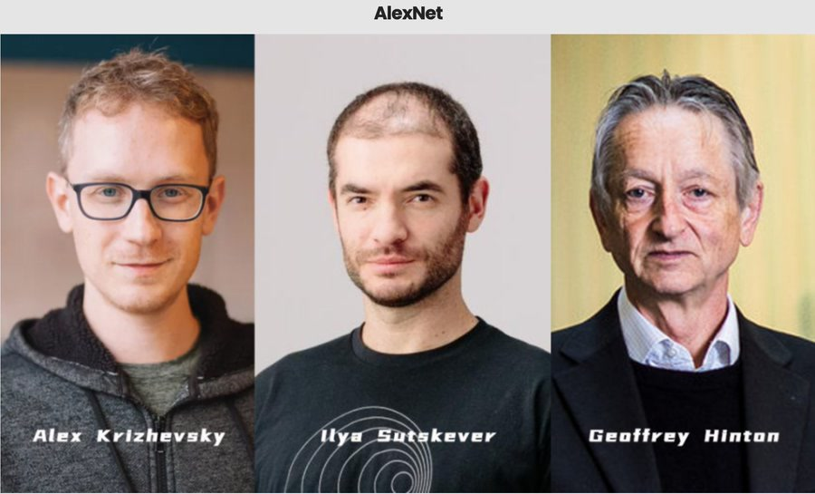

::: {.info header="🧊 Icebreaker Séance 2 : Le paradoxe du Chihuahua"}
**Script pour l'enseignant :**
"Bonjour à tous ! Hier, nous avons nettoyé des tableaux Excel. Aujourd'hui, on donne des yeux à la machine.
*(Afficher au vidéoprojecteur une image du célèbre mème 'Chihuahua ou Muffin aux myrtilles')*.
Pour notre cerveau, distinguer le chien du gâteau prend une fraction de seconde. Pour un algorithme classique 'Si/Alors', c'est mathématiquement impossible à coder. Comment expliquer à un ordinateur ce qu'est une oreille avec des pixels ? C'est tout l'enjeu de la Vision par Ordinateur."
:::

## 2.1 Perspective Historique : De la Neurobiologie aux Réseaux Artificiels 🏛️ 

[🔍 Zoom sur cette section](21_perspective_historique__de_la_neurobiologie_aux_reseaux_artificiels.qmd){.btn .btn-outline-primary .btn-sm}

La vision par ordinateur s'est imposée comme le pont technologique entre la perception biologique et l'intelligence artificielle. En tant qu'architecte système, il ne faut pas voir cette discipline comme un simple algorithme de tri, mais comme une tentative complexe d'extraction automatisée et de compréhension sémantique à partir de flux visuels purs [@networkoptix_2024_computervision].

:::: {.timeline .vertical}

::: {.event data-label="1980"}
| Fukushima | Le Neocognitron |
|:---|:---|
| {width=100px} | *Concept* : Fukushima propose une architecture hiérarchique utilisant des "champs récepteurs" locaux. C'est le précurseur direct des CNN modernes. |
:::

::: {.event data-label="Années 1990"}
| Yann LeCun | La Consécration Industrielle |
|:---|:---|
| {width=100px} | *Application* : Stabilisation avec le modèle *LeNet*, utilisé par la poste américaine pour lire automatiquement les codes postaux. Première preuve de viabilité à grande échelle [@networkoptix_2024_computervision]. |
:::

::: {.event data-label="2012"}
| Équipe Hinton | La Révolution AlexNet |
|:---|:---|
| {width=100px} | *Basculement* : AlexNet pulvérise les algorithmes traditionnels au concours ImageNet, prouvant que la profondeur (Deep Learning) est la clé [@wikipedia_2026_alexnet]. |
:::

::::

### 2.1.2 La Rupture Stratégique : Des filtres manuels aux filtres appris ⚡

Avant le Deep Learning, les ingénieurs devaient créer mathématiquement leurs propres filtres (ex: filtre de Sobel pour les bords verticaux). Cette approche, le *Feature Engineering* manuel, était extrêmement limitée par l'intuition humaine.

La rupture fondamentale des Réseaux Convolutifs (CNN) réside dans le passage aux **filtres appris par optimisation**. Le réseau découvre par essai-erreur quels filtres mathématiques sont les plus pertinents pour extraire les caractéristiques d'une image [@wikipedia_2026_cnn].

## 2.2 Fondamentaux et Supériorité des CNN sur les Modèles Traditionnels 🏗️ 

[🔍 Zoom sur cette section](22_fondamentaux_et_superiorite_des_cnn_sur_les_modeles_traditionnels.qmd){.btn .btn-outline-primary .btn-sm}

Pourquoi ne pas simplement utiliser un réseau de neurones classique (MLP - Multi-Layer Perceptron) pour reconnaître des objets ? La réponse tient en un mot : **le fléau de la dimensionnalité** [@pyimagesearch_2021_cnn_layers].

### 2.2.1 L'échec des réseaux classiques (MLP) ❌

Dans un réseau classique, chaque neurone est connecté à tous les pixels. Imaginons une image de 250x250 pixels en couleur (RGB). L'explosion des paramètres rend l'apprentissage instable, lent et gourmand en mémoire vive 

::: {.graph .horizontal header="Le Fléau de la Dimensionnalité"}

::: {.controls header="Configuration"}
```{ojs}
//| echo: false
resolutions = [28, 250, 1080, 3840];
labels = ["28x28 (MNIST)", "250x250 (Standard)", "1920x1080 (Full HD)", "3840x2160 (4K UHD)"];

viewof res_idx = ui.slider({
  label: "Résolution d'Entrée",
  labels: labels,
  value: 1,
  min: 0,
  max: 3
})

res_choice = resolutions[res_idx];
mlp_weights_per_neuron = res_choice * res_choice * 3;
mlp_total_weights = mlp_weights_per_neuron * 100;
cnn_total_weights = 3 * 3 * 3 * 100;
```
:::

::: {.render header="Visualisation des Poids"}
```{ojs}
//| echo: false
{
  const fixed_cnn_size = 20; 
  const weight_ratio = mlp_total_weights / cnn_total_weights;
  const size_ratio = Math.pow(weight_ratio, 1/6); 
  
  const s_cnn = fixed_cnn_size;
  const s_mlp = Math.min(200, s_cnn * size_ratio);
  
  const mlp_color = mlp_total_weights > 5000000 ? theme.red : theme.orange;
  const cnn_color = theme.green;

  const cube_html = (size, color, label) => {
    const offset = size * 0.35;
    const darken = (c, amt) => `color-mix(in srgb, ${c}, black ${amt}%)`;
    return html`
      <div class="flex-centered-col" style="gap: 8px;">
        <div style="position: relative; width: ${size + offset}px; height: ${size + offset}px; transition: all 0.5s ease;">
          <div style="position: absolute; left: 0; top: 0; width: ${size}px; height: ${offset}px; background: ${darken(color, 15)}; border: 1px solid rgba(0,0,0,0.1); transform: skewX(-45deg); transform-origin: bottom;"></div>
          <div style="position: absolute; left: ${size}px; top: ${offset}px; width: ${offset}px; height: ${size}px; background: ${darken(color, 30)}; border: 1px solid rgba(0,0,0,0.1); transform: skewY(-45deg); transform-origin: left;"></div>
          <div style="position: absolute; left: 0; top: ${offset}px; width: ${size}px; height: ${size}px; background: ${color}; border: 1px solid rgba(0,0,0,0.1); box-shadow: 2px 2px 10px rgba(0,0,0,0.1);"></div>
        </div>
        <span style="font-size: 0.8em; font-weight: bold; color: var(--sol-base01);">${label}</span>
      </div>
    `;
  };

  return html`
    <div style="display: flex; gap: 40px; justify-content: center; align-items: flex-end; min-height: 250px; width: 100%;">
      ${cube_html(s_cnn, cnn_color, "CNN")}
      ${cube_html(s_mlp, mlp_color, "MLP")}
    </div>
  `;
}
```
:::

::: {.results}
```{ojs}
//| echo: false
{
  const status = mlp_total_weights > 10000000 ? "danger" : mlp_total_weights > 1000000 ? "warning" : "debug";
  const analysis = mlp_total_weights > 10000000 ? "🚨 Incalculable sur un PC standard. Le MLP sature la mémoire." : mlp_total_weights > 1000000 ? "⚠️ Très lourd. L'entraînement sera lent et inefficace." : "Stable et léger.";

  return ui.card(md`
| Architecture | Paramètres par Unité | Total (couche de 100) |
|:---|:---|:---|
| ❌ Classique (MLP) | ${mlp_weights_per_neuron.toLocaleString()} | **${mlp_total_weights.toLocaleString()}** poids |
| ✅ Convolutif (CNN) | 27 | **${cnn_total_weights.toLocaleString()}** poids |

**Analyse :** ${analysis}
`, { title: "Impact sur l'Architecture", status: status });
}
```
:::
:::

### 2.2.2 Les trois piliers stratégiques des CNN 🏛️

Les CNN exploitent la structure spatiale via trois propriétés [@upgrad_2026_cnn_architecture; @wikipedia_2026_cnn] :

1.  **Connectivité locale :** Un neurone ne regarde qu'une petite zone limitée (champ récepteur), imitant le cortex visuel humain.
2.  **Partage de poids :** Le réseau utilise le même filtre sur toute la surface, réduisant les paramètres et détectant un motif n'importe où.
3.  **Arrangement spatial en 3D :** Les données circulent en tenseurs (Largeur x Hauteur x Profondeur des couleurs/filtres) [@pyimagesearch_2021_cnn_layers].

---

## 2.3 Anatomie Technique d'un CNN : Convolution, Activation et Pooling 🔬 

[🔍 Zoom sur cette section](23_anatomie_technique_dun_cnn__convolution_activation_et_pooling.qmd){.btn .btn-outline-primary .btn-sm}

Un CNN transforme des pixels bruts en prédictions sémantiques.

### 2.3.1 & 2.3.3 Convolution et Pooling : Démystification Visuelle 🌀🎱

La **Couche de Convolution** réalise un produit de Frobenius entre un noyau glissant et l'entrée pour extraire des traits. La **Couche de Pooling** (ex: Max Pooling) réduit la résolution spatiale pour contrôler le surapprentissage tout en conservant le signal le plus fort.

::: {.graph .vertical header="Max-Pooling : Distiller l'Essentiel"}

::: {.render header="Visualisation du Pooling"}
```{ojs}
//| echo: false
//| warning: false
{
  const gridInValues = [12, 20, 30, 0, 8, 12, 2, 0, 34, 70, 37, 4, 112, 100, 25, 12];
  const colors = [theme.red, theme.blue, theme.green, theme.yellow];
  const getGroup = (i) => {
    if ([0,1,4,5].includes(i)) return 0;
    if ([2,3,6,7].includes(i)) return 1;
    if ([8,9,12,13].includes(i)) return 2;
    return 3;
  };

  const container = html`
    <div class="matrix-viz-container">
      <div class="matrix-labels">
         <span>Image d'Entrée (4x4)</span>
      </div>
      <div class="matrix-row">
        <div id="grid-in" class="matrix-grid-in">
          ${gridInValues.map((val, i) => {
            const group = getGroup(i);
            const color = colors[group];
            return `<div class="cell-in matrix-cell" data-group="${group}" style="background: ${color}; color: ${theme.base3};">${val}</div>`
          }).join('')}
        </div>
        
        <div class="matrix-arrow">⬇️</div>
        
        <div class="matrix-labels">
          <span>Sortie Pooled (2x2)</span>
        </div>
        <div id="grid-out" class="matrix-grid-out">
          <div class="cell-out matrix-cell-out" data-group="0" style="background: ${theme.red}; color: ${theme.base3};">20</div>
          <div class="cell-out matrix-cell-out" data-group="1" style="background: ${theme.blue}; color: ${theme.base3};">30</div>
          <div class="cell-out matrix-cell-out" data-group="2" style="background: ${theme.green}; color: ${theme.base3};">112</div>
          <div class="cell-out matrix-cell-out" data-group="3" style="background: ${theme.yellow}; color: ${theme.base3};">37</div>
        </div>
      </div>
      
      <div id="pool-explanation" class="card bg-debug pool-explanation-card">
         <div class="card-body" id="explanation-text">
            💡 <b>Astuce :</b> Cliquez sur une zone colorée pour comprendre comment le chiffre est extrait.
         </div>
      </div>
    </div>
  `;

  const cellsIn = container.querySelectorAll(".cell-in");
  const cellsOut = container.querySelectorAll(".cell-out");
  const explanationCard = container.querySelector("#pool-explanation");
  const explanationText = container.querySelector("#explanation-text");

  const updateHighlight = (group) => {
    const values = gridInValues.filter((_, i) => getGroup(i) === group);
    const maxVal = Math.max(...values);
    
    // Update explanation state
    explanationCard.setAttribute("data-group", group);
    explanationText.innerHTML = `Dans la zone <b>${["Rouge", "Bleue", "Verte", "Jaune"][group]}</b>, on compare {${values.join(", ")}}. <br> Le plus grand est <b>${maxVal}</b>, c'est lui qui survit au Pooling !`;
    
    // Reset all cells
    cellsIn.forEach(c => c.classList.remove("active", "is-max", "is-group"));
    cellsOut.forEach(c => c.classList.remove("active"));
    
    // Highlight group and max
    container.querySelectorAll(`.cell-in[data-group="${group}"]`).forEach(c => {
      c.classList.add("active", "is-group");
      if (parseInt(c.innerText) === maxVal) {
        c.classList.add("is-max");
      }
    });
    
    // Highlight matching output cell
    container.querySelector(`.cell-out[data-group="${group}"]`).classList.add("active");
  };

  cellsIn.forEach(cell => {
    cell.addEventListener("click", () => {
      updateHighlight(parseInt(cell.getAttribute("data-group")));
    });
  });

  cellsOut.forEach(cell => {
    cell.addEventListener("click", () => {
      updateHighlight(parseInt(cell.getAttribute("data-group")));
    });
  });

  return container;
}
```
:::
:::


### 2.3.5 Configuration Spatiale : Les Hyperparamètres 📏

Le dimensionnement d'un CNN repose sur une configuration géométrique stricte.

*   **Stride (Pas) :** Définit le saut du filtre. Un stride > 1 agit comme un compresseur de données.
*   **Padding :** Ajout de pixels aux bordures pour éviter la perte d'information sur les contours.

::: {.warning header="Règle d'or de l'Architecte : La Formule de Sortie"}
Pour une dimension d'entrée $W$, un filtre $F$, un padding $P$ et un stride $S$, la taille de sortie est :
$$\text{Sortie} = \frac{W - F + 2P}{S} + 1$$
Si le résultat n'est pas un entier, la configuration est invalide !
:::

::: {.graph header="Calculateur de Sortie"}

::: {.controls}
```{ojs}
//| echo: false
viewof hyper_W = ui.slider({label: "Entrée (W)", value: 227, min: 10, max: 227, step: 1})
viewof hyper_F = ui.slider({label: "Filtre (F)", value: 11, min: 1, max: 11, step: 1})
viewof hyper_P = ui.slider({label: "Padding (P)", value: 0, min: 0, max: 5, step: 1})
viewof hyper_S = ui.slider({label: "Stride (S)", value: 4, min: 1, max: 5, step: 1})

output_size = (hyper_W - hyper_F + 2 * hyper_P) / hyper_S + 1
is_valid_arch = Number.isInteger(output_size)
```
:::

::: {.results}
```{ojs}
//| echo: false
{
  const status = is_valid_arch ? "success" : "danger";
  return ui.card(md`
Taille de la carte d'activation en sortie : **${output_size} x ${output_size} pixels**

${is_valid_arch 
  ? "✅ **Configuration Valide.** Les neurones se répartissent parfaitement." 
  : "🔴 **ERREUR GÉOMÉTRIQUE :** Résultat décimal ! Le filtre va déborder de l'image. *Astuce : Essayez d'ajuster le Padding.*"}
`, { title: "Calculateur d'Architecture (En Temps Réel)", status: status });
}
```
:::
:::


---

## 2.4 Étude de Cas : La Révolution AlexNet (2012) 🏆 

[🔍 Zoom sur cette section](24_etude_de_cas__la_revolution_alexnet_2012.qmd){.btn .btn-outline-primary .btn-sm}

Si l'on devait dater le début de l'ère moderne de l'IA, ce serait 2012 avec le réseau **AlexNet** qui a pulvérisé les modèles traditionnels au concours ImageNet [@wikipedia_2026_alexnet].

*   **L'adoption de ReLU :** Contourne le *vanishing gradient*, entraînement beaucoup plus rapide [@upgrad_2026_cnn_architecture].
*   **L'invention du Dropout :** Technique contre le surapprentissage.
*   **L'entraînement Multi-GPU :** Modèle scindé sur deux puces NVIDIA GTX 580 car trop lourd pour la VRAM de l'époque.

::: {.warning header="Anecdote d'Architecte : L'énigme des 224 pixels"}
Les tutoriels disent qu'AlexNet prend des images de 224x224. Mais avec un filtre de 11, un stride de 4 et un padding de 0, la formule (vue au-dessus) ne tombe pas juste ! En réalité, le réseau recadrait secrètement à **227x227 pixels** pour satisfaire les mathématiques [@pyimagesearch_2021_cnn_layers].
:::

---

## 2.5 Défis Critiques : Overfitting et Techniques de Régularisation ⚠️ 

[🔍 Zoom sur cette section](25_defis_critiques__overfitting_et_techniques_de_regularisation.qmd){.btn .btn-outline-primary .btn-sm}

Un CNN moderne possède des millions de paramètres. S'il s'entraîne trop longtemps, il fait du **Surapprentissage (Overfitting)** : il mémorise par cœur le Train set, mais échoue sur le Test set [@greatlearning_2025_overfitting; @nerchuko_2026_bias_variance].

### 2.5.1 Le Dropout (Le Décrochage) 🔌

Le Dropout désactive aléatoirement un certain pourcentage de neurones à chaque passage pour forcer le réseau à répartir la connaissance [@wikipedia_2026_cnn].

::: {.graph header="Contrôle du Dropout"}

::: {.controls}
```{ojs}
//| echo: false
viewof drp_rate = ui.slider({label: "Taux de Dropout", value: 0.6, min: 0, max: 0.9, step: 0.01})

// Fonctions de calcul partagées pour la cohérence
calc_tr_loss = (dr, epoch) => 2 + 5 * Math.exp(-epoch / 15) + (dr * 0.5);

calc_val_loss = (dr, epoch) => {
  let tr = calc_tr_loss(dr, epoch);
  if (dr < 0.3) {
    return 2.1 + 5 * Math.exp(-epoch / 15) + (epoch * (0.3 - dr) * 0.1);
  } else if (dr > 0.7) {
    return tr + 1.5;
  } else {
    return tr + 0.3;
  }
}

data_loss = {
  const pts = [];
  for(let epoch = 1; epoch <= 50; epoch++) {
    pts.push({epoch: epoch, loss: calc_tr_loss(drp_rate, epoch), type: "Train Loss"});
    pts.push({epoch: epoch, loss: calc_val_loss(drp_rate, epoch), type: "Validation Loss (Réalité)"});
  }
  return pts;
}

data_dropout_curve = {
  const pts = [];
  for(let dr = 0; dr <= 0.9; dr += 0.02) {
    pts.push({dr: dr, loss: calc_val_loss(dr, 50)});
  }
  return pts;
}
```
:::

::: {.graph .horizontal header="Analyse du Dropout"}

::: {.render header="Évolution Temporelle"}
```{ojs}
//| echo: false
Plot.plot({
  height: 300,
  background: "transparent",
  grid: true,
  y: {domain: [1.5, 7], label: "Erreur (Loss)"},
  x: {label: "Époques d'entraînement"},
  color: {legend: true, domain: ["Train Loss", "Validation Loss (Réalité)"], range: [theme.blue, theme.red]},
  marks: [
    Plot.line(data_loss, {x: "epoch", y: "loss", stroke: "type", strokeWidth: 3})
  ]
})
```
:::

::: {.render header="Impact du Taux"}
```{ojs}
//| echo: false
Plot.plot({
  height: 300,
  background: "transparent",
  grid: true,
  x: {label: "Taux de Dropout", domain: [0, 0.9]},
  y: {domain: [1.5, 7], label: "Erreur de Validation (Époque 50)"},
  marks: [
    Plot.rectX([0], {x1: 0, x2: 0.3, fill: theme.red, fillOpacity: 0.1}),
    Plot.rectX([0], {x1: 0.68, x2: 0.9, fill: theme.yellow, fillOpacity: 0.1}),
    Plot.ruleX([0.5], {stroke: theme.green, strokeWidth: 2, strokeDasharray: "5,5"}),
    Plot.line(data_dropout_curve, {x: "dr", y: "loss", stroke: theme.red, strokeWidth: 2, strokeDasharray: "4,4", strokeOpacity: 0.5}),
    Plot.text([{dr: 0.15, loss: 6.5, label: "SURAPPRENTISSAGE"}], {x: "dr", y: "loss", text: "label", fontWeight: "bold", fill: theme.red, fontSize: 10}),
    Plot.text([{dr: 0.8, loss: 6.5, label: "SOUS-APPRENTISSAGE"}], {x: "dr", y: "loss", text: "label", fontWeight: "bold", fill: theme.yellow, fontSize: 10}),
    Plot.text([{dr: 0.5, loss: 1.8, label: "CIBLE OPTIMALE"}], {x: "dr", y: "loss", text: "label", fontWeight: "bold", fill: theme.green, fontSize: 10}),
    Plot.dot([{dr: drp_rate, loss: calc_val_loss(drp_rate, 50)}], {x: "dr", y: "loss", fill: theme.red, r: 7, stroke: "white", strokeWidth: 2})
  ]
})
```
:::

:::{.results}
```{ojs}
//| echo: false
{
  const status = drp_rate === 0 ? "danger" : drp_rate === 0.5 ? "success" : drp_rate >= 0.8 ? "warning" : "debug";
  return ui.card(md`
**${drp_rate === 0 ? "🚨 OVERFITTING (Surapprentissage grave) ! Les courbes divergent." : drp_rate === 0.5 ? "✅ OPTIMAL. Les courbes descendent ensemble." : drp_rate >= 0.8 ? "⚠️ UNDERFITTING (Sous-apprentissage). Trop de neurones désactivés, le réseau n'apprend plus." : "Stable."}**
`, { title: "Statut de l'entraînement", status: status });
}
```
:::
:::
:::


### 2.5.3 L'Augmentation de Données (Data Augmentation) 🖼️

La meilleure façon de combattre le surapprentissage est d'appliquer des transformations aléatoires à vos images d'entraînement à la volée. Le modèle voit une image légèrement différente à chaque fois [@wikipedia_2026_cnn].

::: {.graph .horizontal header="Augmentation de Données"}

::: {.controls}
```{ojs}
//| echo: false
viewof do_rot = ui.checkbox({label: "🔄 Rotation"})
viewof do_flip = ui.checkbox({label: "↔️ Effet Miroir"})
viewof do_zoom = ui.checkbox({label: "🔍 Zoom"})
```
:::

::: {.separator}
➡️
:::

::: {.render header="Vue Machine"}
```{ojs}
//| echo: false
html`
<div class="augmentation-display-side">
  <div class="viz-viewport viz-augmentation-viewport">
    <div class="viz-emoji" style="
      transform: 
        rotate(${do_rot ? '25deg' : '0deg'}) 
        scaleX(${do_flip ? '-1' : '1'}) 
        scale(${do_zoom ? '2.5' : '1'});">
      🐶
    </div>
    <div class="viz-overlay"></div>
  </div>
</div>
`
```
:::

::: {.results}
::: {.warning}
Pour la machine, l'information matricielle de ces variantes est **totalement différente** !
:::
:::
:::

## 2.6 Horizon Actuel : Applications Industrielles et Limites 🔭 

[🔍 Zoom sur cette section](26_horizon_actuel__applications_industrielles_et_limites.qmd){.btn .btn-outline-primary .btn-sm}

### 2.6.2 Le Nouveau Challenger : Les Vision Transformers (ViT) 🤖

Contrairement aux CNN qui regardent l'image petit bout par petit bout, les **Vision Transformers (ViT)** découpent l'image en "patchs" et utilisent un mécanisme d'**attention globale**. Ils comparent chaque patch avec tous les autres simultanément [@networkoptix_2024_computervision].

::: {.graph .horizontal header="Comparaison Architecturale : Local vs Global"}

::: {.render header="Filtre Local (CNN)"}
```{ojs}
//| echo: false
html`
<div class="viz-container-sm viz-cnn-grid" style="position: relative;">
  <div class="viz-cnn-window"></div>
  ${Array(16).fill(0).map(() => `<div style="border: 1px solid rgba(0,172,193,0.1);"></div>`).join('')}
</div>
`
```
:::

::: {.separator}
VS
:::

::: {.render header="Attention Globale (ViT)"}
```{ojs}
//| echo: false
html`
<div class="viz-container-sm viz-vit-grid" style="position: relative;">
  ${Array(9).fill(0).map((_, i) => `<div style="background: rgba(108, 113, 196, 0.1); border: 1px solid ${theme.violet}; border-radius: 4px; position: relative; display: flex; align-items: center; justify-content: center;"><span style="position: absolute; width: ${i===4 ? '200%' : '0'}; height: 2px; background: ${theme.magenta}; z-index: 10; animation: flashNet 2s infinite;"></span></div>`).join('')}
  <div class="viz-vit-ring"></div>
</div>
`
```
:::

:::{.results}
::: {.info header="Comparaison Architecturale : Local vs Global"}
Observez la différence de philosophie. À gauche, le CNN scanne laborieusement l'image. À droite, le Transformer connecte toutes les informations simultanément.
:::
:::
:::


## 2.7 Conclusion et Transition 🌉

C'est d'ailleurs cette architecture Transformer qui a donné naissance à l'IA Générative et aux LLM. Les modèles ne se contentent plus de *classifier* des données, ils sont capables d'en *créer* de nouvelles. 

Ce changement de paradigme nous amène directement à notre **[Chapitre 3 : GenAI & NLP](../3_genai/index.qmd)** !
